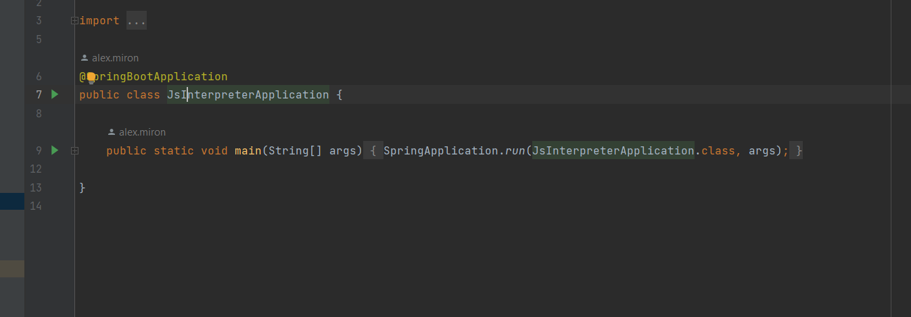
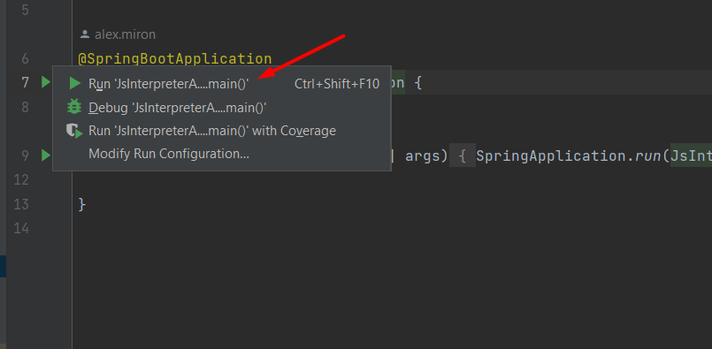
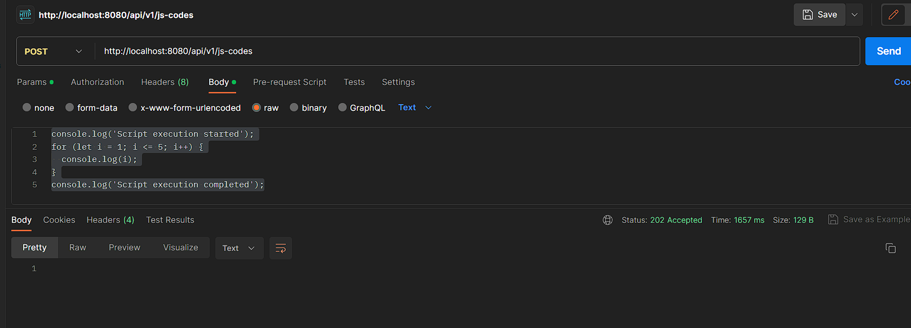
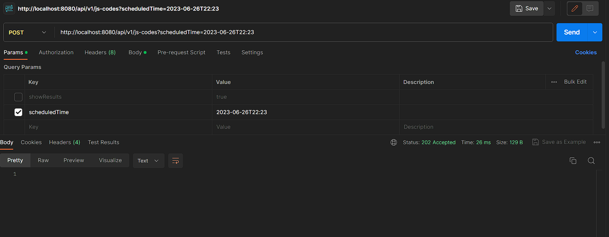
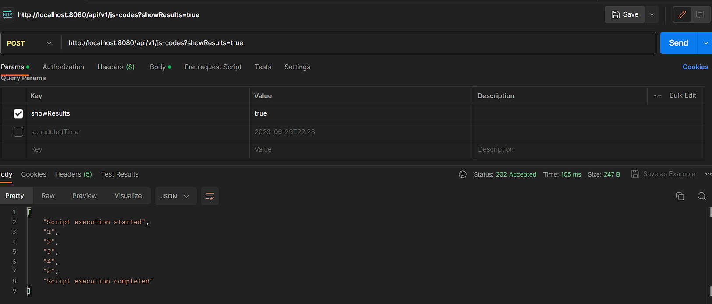

# JS-interpreter

## Setting up MongoDB via Docker
```
docker run --name local-mongo-js-interpreter -d -p 2701:27017  mongo:6.0
```
### Additional settings for MongoDB(via CLI)
```
docker exec -it local-mongo-js-interpreter /bin/bash
mongosh
use js_interpreter
show dbs
```
After that you will see list of all databases in mongo and one of them must be js_interpreter

## Run instructions
### Via IDE(IntelliJ IDEA)
1. Go to the main class

2. Running application


## Example of general operation via postman
Make POST request
```
http://localhost:8080/api/v1/js-codes
```
with body
```
console.log('Script execution started');
for (let i = 1; i <= 5; i++) {
  console.log(i);
}
console.log('Script execution completed');
```


Request with scheduling

#### NOTICE

Use this number format for scheduling, eg.  `2023-06-23T22:29`
```
http://localhost:8080/api/v1/js-codes?scheduledTime=2023-06-26T22:23
```


Request with showing 

```
http://localhost:8080/api/v1/js-codes?showResults=true
```


### IMPORTANT
> We can not use in the same time showing and scheduling.


